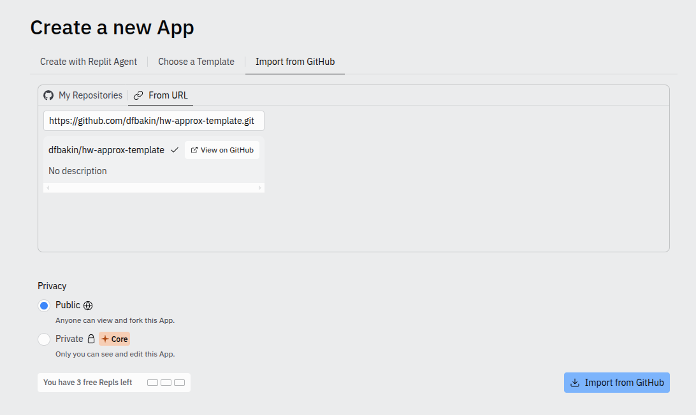
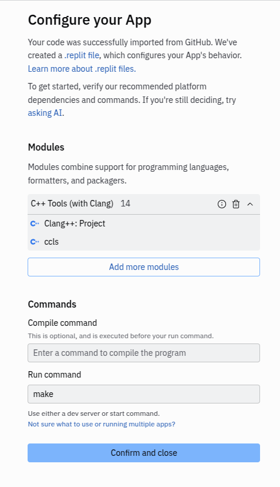

# Как собрать и запустить локально?
## Установлен `Make`

```bash
make
```

## Не установлен `Make`
```bash
g++ -g -O3 -Ifparser4.5.2 main.cpp fparser4.5.2/fparser.cc fparser4.5.2/fpoptimizer.cc -o output_solution
./output_solution
```


# Как собрать и запустить онлайн?

- Авторизуемся в [replt.it](replt.it)
- При создании проекта выбираем импорт репозитория и вставляем ссылку как на скрине ниже:

- Не забываем указать команду для автоматического запуска по кнопке и подтвердить настройку

- после этого открываем редактор `main.cpp` файла в одной вкладке repl.it и Console в другой.
Теперь при нажатии на зеленую кнопку `Run` в консоле будет собран и запущен ваш файл. Обратите внимание,
на ошибки во время компиляции -- тогда она не завершится и может быть запущена старая версия исполняемого файла
- теперь у вас создан и настроен проект в онлайн среде разработки
